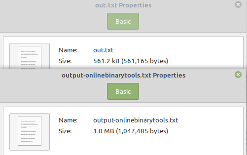

# Huffman Compression and Decompression:
Computer users are faced with a choice when converting a file into binary.
Every char in the ascii table has an associated binary string, but these aren't optimized for minimum length.
The other choice is to create optimized binary strings for each char. Optimizing binary strings means that the more common a
char is in the file: the shorter the string. To create these strings, a binary tree is created based on the frequencies of each char in the file.
The chars contained in the nodes of the upper level of the Huffman tree will be of relatively high frequency; the converse is true on the lower levels of the tree.
The bitstrings for chars are created with this logic: 1 is the right subtree of a node and 0 is the left. The bitstrings are used to traverse the tree in this 1 or 0 manner
until it's associated char is found. Using the chars and their associated set of bitstrings it is possible to convert and revert a file into binary in a optimized (compressed)
way. This is what my program does. [Click this](https://en.wikipedia.org/wiki/Huffman_coding) for more information on the algorithm and the creator of it.

# How to use:
- Make sure your computer has a [terminal](https://towardsdatascience.com/a-quick-guide-to-using-command-line-terminal-96815b97b955), and [python 2 (or higher)](https://phoenixnap.com/kb/check-python-version) installed.
- In your terminal, change into the directory you would like this program to be stored.
- Clone repo to your computer using this command:
```
$ git clone https://github.com/elliott1177/huffman-compress.git
```
- To compile:
```
$ cd huffman-compress
$ chmod +x huffman.py
```
- To encode a file:
```
$ ./huffman.py e inputfile.txt outputfile.txt
```
- To decode a file:
```
$ ./huffman.py d inputfile.txt outputfile.txt
```

# Proof that it works:
## Testing my program on the Shakespeare play Macbeth:
```
$ ./huffman.py e macbeth.txt out.txt
```
## Putting Macbeth into a binary converter:
- I used this [website](https://onlinebinarytools.com/convert-text-to-binary) to convert Macbeth to binary based on ascii values, not a Huffman tree. It outputted a file named: output-onlinebinarytools.txt
## Comparing out.txt with output-onlinebinarytools.txt:

- As you can see, the Huffman algorithm produced a binary file ~ half the size of ascii bitstring conversion.
